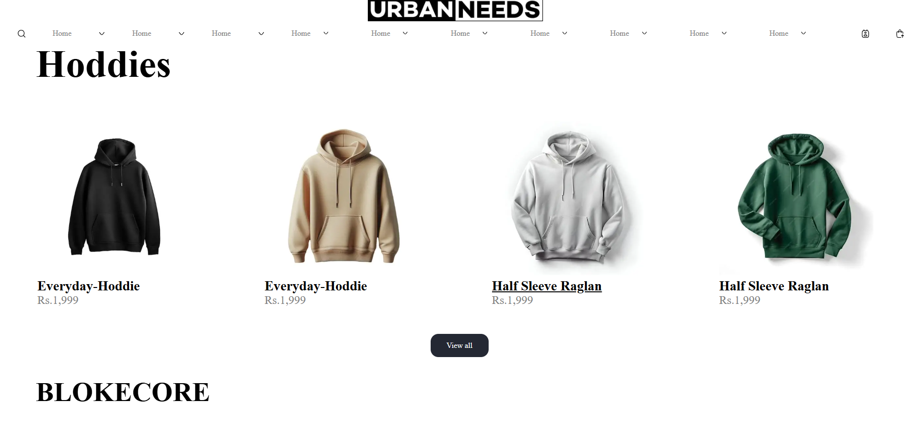
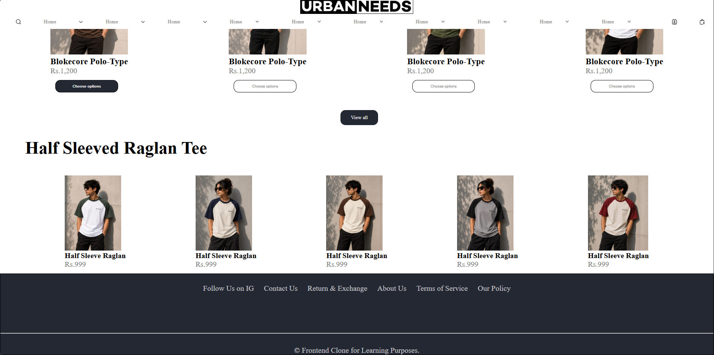

# Urban Needs Clone

-A responsive front-end clone of the Urban Needs clothing website built using HTML and CSS. This project recreates the look and feel of an e-commerce fashion website with a clean and modern user interface.

## Preview

-Add screenshots of your project here.

## Features

- Responsive navigation bar
- Hero banner section
- Product categories
  - Hoodies
  - Blokecore Collection
  - Half Sleeved Raglan Tees
- Product cards with images and pricing
- "View All" sections
- Clean and modern layout
- Built using pure HTML and CSS

## Technologies Used

- HTML5
- CSS3

## Screenshots

### Home Screen

### Hoodies List

### Tees List

## Future Improvements

- Add JavaScript for interactivity
- Implement product search functionality
- Add a shopping cart
- User authentication
- Product filtering and sorting
- Responsive mobile navigation
- Backend integration

## License

This project is created for learning and educational purposes only. It is not affiliated with or endorsed by Urban Needs.
