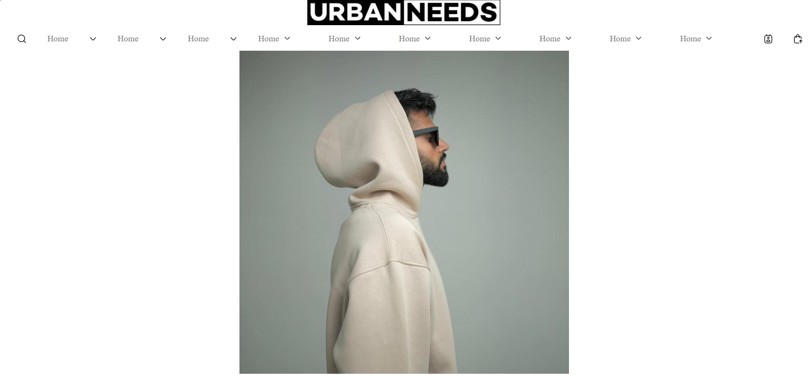

# URBANNEEDS Frontend Clone

A responsive frontend clone of the **URBANNEEDS** clothing website built using **HTML5** and **CSS3**. This project recreates a modern fashion e-commerce homepage with a clean layout, multiple product sections, and a minimal user interface. It was developed as a frontend practice project to improve HTML and CSS skills.

## Preview

## Screenshots

### Home Screen



### Hoodies List


### Tees List


## Features

- Responsive navigation bar
- Modern and minimal user interface
- Multiple product categories
- Product cards with images, names, and prices
- "Choose Options" buttons
- "View All" buttons
- Clean typography and spacing
- Responsive layout
- Footer with useful links

## Technologies Used

- HTML5
- CSS3
- Google Fonts
- Font Awesome Icons

## Getting Started

1. Clone the repository.

```bash
git clone https://github.com/your-username/urbanneeds-clone.git
```

2. Open the project folder.

3. Open `index.html` in your preferred web browser.

No additional setup or installation is required.

## Learning Objectives

This project helped in practicing:

- Semantic HTML
- CSS Flexbox
- Responsive Web Design
- Product Card Layouts
- Navigation Bar Design
- Website Structure
- Clean UI Design

## Future Improvements

- Mobile navigation menu
- Search functionality
- Product filtering
- Shopping cart page
- Product detail pages
- JavaScript interactions
- Backend integration

## Disclaimer

This project is created **for educational and learning purposes only**. It is a frontend clone inspired by the URBANNEEDS website and is not affiliated with or endorsed by the original brand.

## Author

**Md Hussain Inamdar**

GitHub: https://github.com/your-username

---

If you like this project, consider giving it a ⭐ on GitHub.