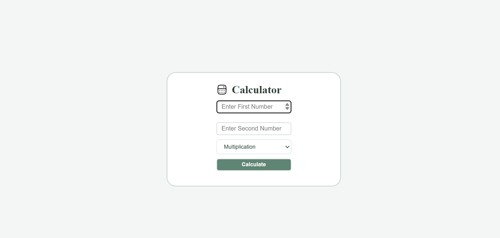
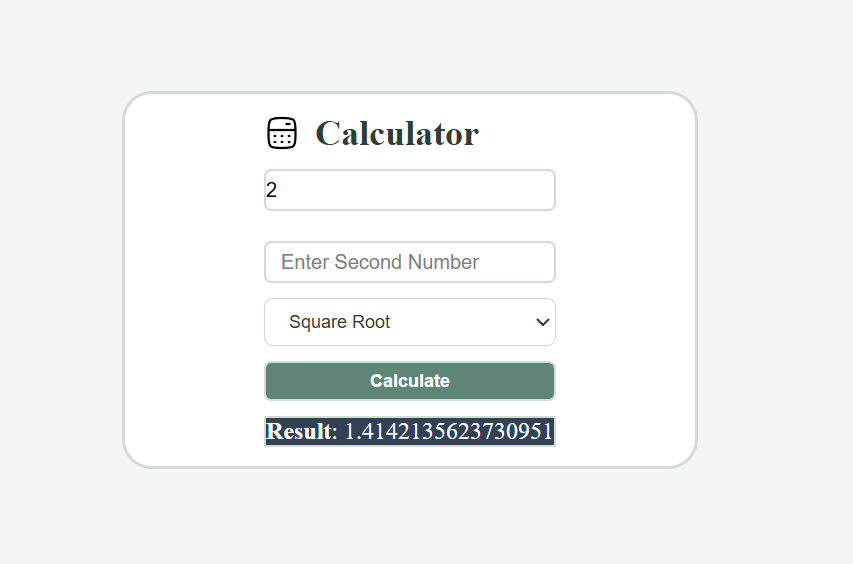

# Simple Calculator

A simple and responsive calculator built using HTML, CSS, and JavaScript. It supports basic arithmetic operations along with square, square root, and power calculations through a clean and intuitive user interface.

## Features

- Addition
- Subtraction
- Multiplication
- Division
- Modulus
- Power Calculation
- Square
- Square Root
- Responsive Design
- Clean and Minimal User Interface

## Technologies Used

- HTML5
- CSS3
- JavaScript

## Project Structure

```text
SIMPLE-CALCULATOR/
│── Screenshots/
│── calculator-01-stroke-rounded.svg
│── favicon.ico
│── index.html
│── script.js
│── style.css
│── README.md
```

## Screenshots

## Screenshots

### Home Screen



### Result




## How to Run

1. Clone the repository.

```bash
git clone https://github.com/your-username/simple-calculator.git
```

2. Open the project folder.

3. Open `index.html` in your preferred web browser.

## Future Improvements

- Scientific calculator functions
- Keyboard support
- Calculation history
- Dark and Light theme toggle
- Improved input validation

## License

This project is licensed under the MIT License.