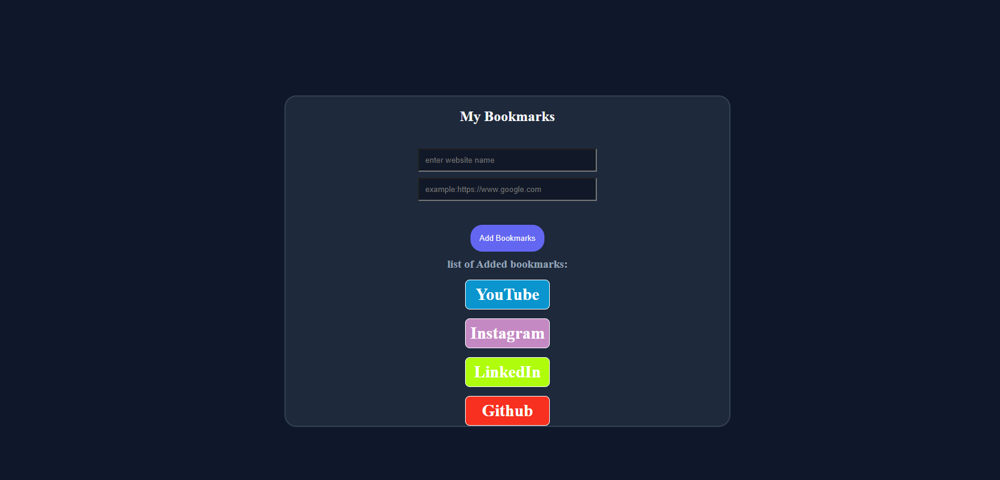

# Bookmark Manager

A simple and responsive Bookmark Manager built using HTML, CSS, and JavaScript. This application allows users to save and access their favorite websites from one place.

## Preview



> Replace `screenshot.png` with your project screenshot.

---

## Features

- Add website bookmarks
- Save website names and URLs
- Open saved bookmarks with a single click
- Random background color generated for every newly added bookmark
- Responsive user interface
- Clean and modern dark-themed design

---

## Technologies Used

- HTML5
- CSS3
- JavaScript (ES6)

---

## Project Structure

```
Bookmark-Manager/
│
├── index.html
├── style.css
├── script.js
├── screenshot.png
└── README.md
```

---

## Installation

1. Clone the repository.

```bash
git clone https://github.com/your-username/bookmark-manager.git
```

2. Navigate to the project directory.

```bash
cd bookmark-manager
```

3. Open `index.html` in your browser.

Alternatively, you can use the **Live Server** extension in Visual Studio Code.

---

## How It Works

1. Enter the website name.
2. Enter the website URL.
3. Click the **Add Bookmark** button.
4. A new bookmark is added to the list.
5. Each newly added bookmark is assigned a randomly generated background color.
6. Click any bookmark to open the corresponding website.

---

## Author

**Md Hussain Inamdar**

---

## License

This project is licensed under the MIT License.