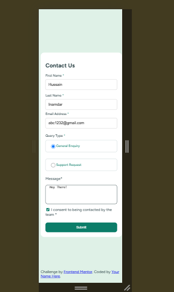
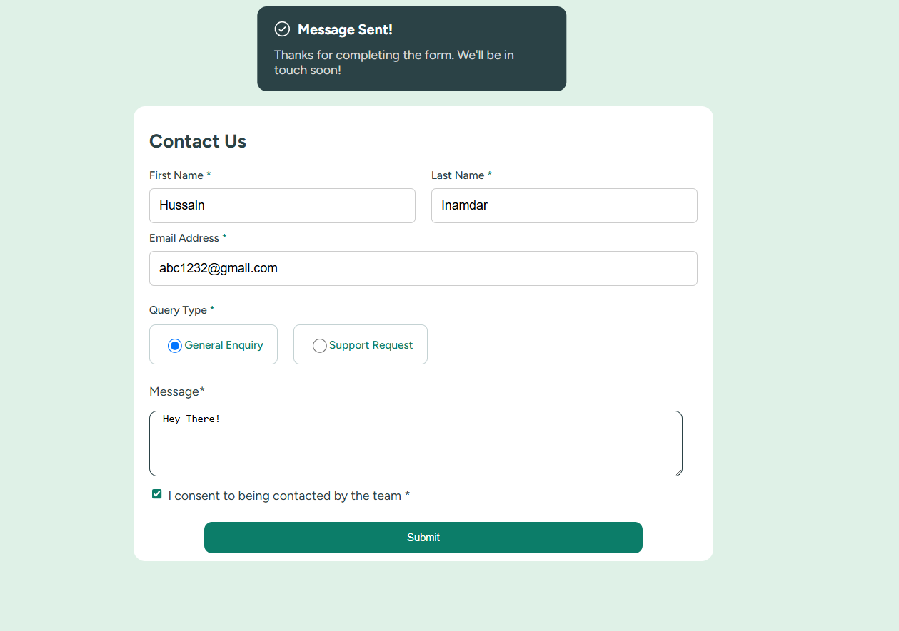

# Contact Form

A responsive contact form built as part of the Frontend Mentor challenge. The project includes client-side form validation, responsive design, and a success toast notification displayed after a valid form submission.

## Built With

- HTML5
- CSS3
- Flexbox
- Media Queries
- JavaScript

## Features

- Responsive layout
- Form validation
- Email validation
- Query type selection
- Consent checkbox validation
- Success toast notification
### Screenshot

### Desktop View

### Mobile View

## Live Demo

Live Site: https://challenge2frontmentor.netlify.app/

Solution: https://www.frontendmentor.io/solutions/your-solution-link

## Author

GitHub:   https://github.com/mdhussaininamdar195-jpg
LinkedIn: https://linkedin.com/in/mohammed-hussain-inamdar-b0486634b
Portfolio:https://mohammedhussain.netlify.app/

