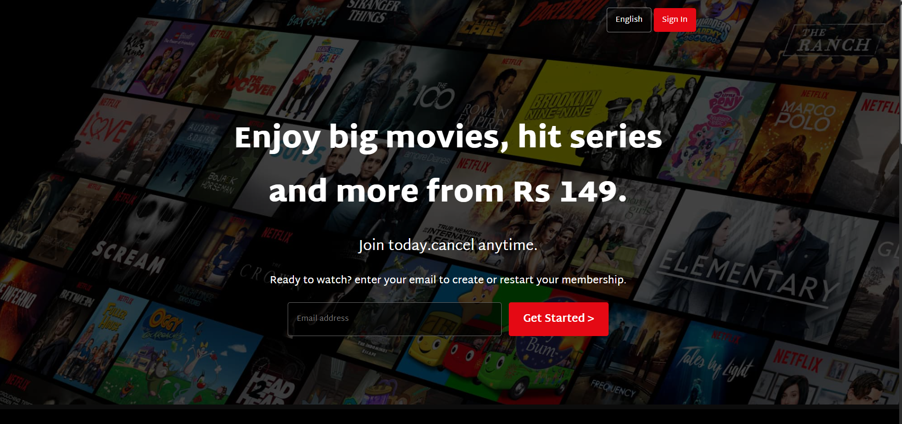
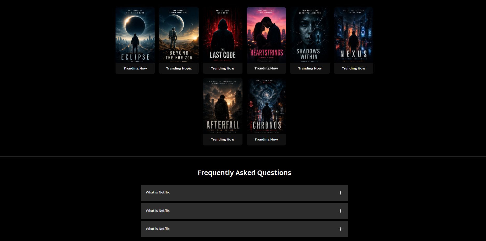

# Netflix Clone

A simple Netflix landing page clone built to practice HTML and CSS. The goal of this project was to improve my understanding of page layouts, responsive design, and creating a clean user interface by recreating the look and feel of the Netflix homepage.

# Features

- Responsive design for different screen sizes
- Navigation bar
- Hero section with background image
- Movie and TV show sections
- Footer similar to the original website
- Clean and organized code

 # Technologies Used

- HTML5
- CSS3
## Screenshots

### Home Screen

### Movies List

 # Purpose

This project was created for learning and practice. It helped me get comfortable with writing semantic HTML, using Flexbox for layouts, and making webpages responsive with CSS media queries.

# Disclaimer

This is an educational project created for learning purposes only. It is not affiliated with or endorsed by Netflix. All trademarks, logos, and any media used belong to their respective owners.

# Future Improvements

- Add JavaScript for interactive elements
- Improve animations and hover effects
- Add more responsive improvements
- Build additional pages

Author

Md Hussain Inamdar