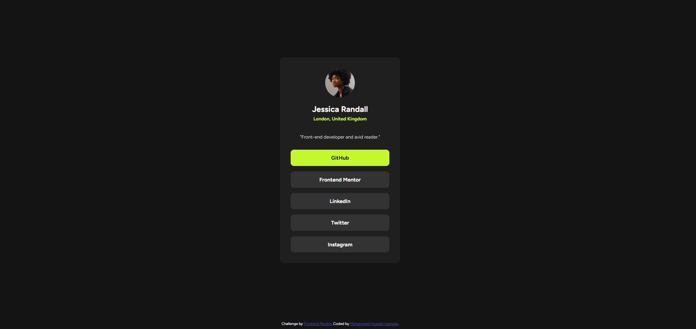

# Frontend Mentor - Social Links Profile Solution

This is my solution to the **Social Links Profile** challenge on Frontend Mentor. The goal was to recreate the provided design using HTML and CSS while ensuring the layout is responsive and visually matches the original design.

## Overview

### Screenshot

### Links

- Live Site URL: https://your-live-site-url.netlify.app
- Solution URL: https://www.frontendmentor.io/solutions/your-solution-link

## Built With

- HTML5
- CSS3
- Flexbox
- Responsive Design
- Google Fonts (Figtree)

## What I Learned

While building this project, I learned how to:

- Structure a webpage using semantic HTML.
- Create responsive layouts with Flexbox.
- Import and use Google Fonts.
- Style buttons with hover effects.
- Match a design provided by Frontend Mentor.

## Continued Development

In future projects, I want to improve my skills in:

- CSS Grid
- Responsive layouts
- CSS animations and transitions
- Writing cleaner and more maintainable CSS

## AI Collaboration

I used ChatGPT as a learning assistant to:

- Understand responsive design techniques.
- Debug CSS issues.
- Learn the correct way to import and use Google Fonts.

The final implementation and styling were completed and customized by me.

## Author

- Portfolio: https://mohammedhussain.netlify.app
- GitHub: https://github.com/YOUR_GITHUB_USERNAME
- Frontend Mentor: https://www.frontendmentor.io/profile/YOUR_FRONTEND_MENTOR_USERNAME

## Acknowledgments

Thanks to Frontend Mentor for providing practical frontend challenges that help developers improve their HTML and CSS skills through real-world projects.